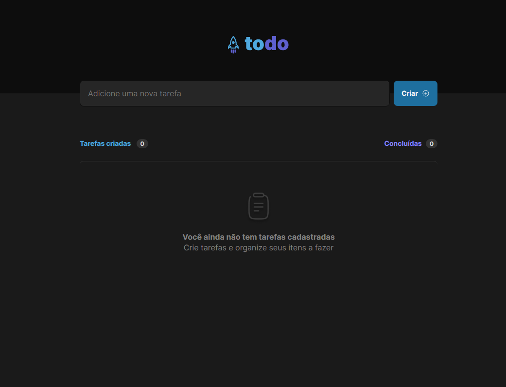
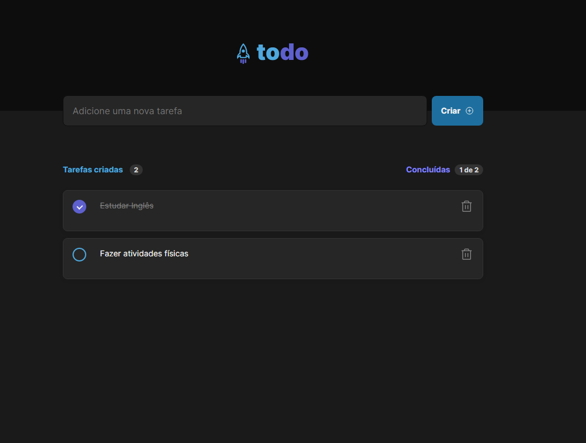

# Desafio 01 - Praticando os conceitos do ReactJS

<p align="center">


<br>

<p align="center"><em>Confira o resultado do desafio em: <a href="https://ignite-reactjs-todo-list-vitor.vercel.app" target="_blank">ignite-reactjs-todo-list-vitor.vercel.app</a></em></p>

## :computer: Sobre o desafio

<hr>

Nesse desafio, você vai desenvolver uma aplicação de controle de tarefas no estilo **to-do list**, que contém as seguintes funcionalidades:

- Adicionar uma nova tarefa
- Marcar e desmarcar uma tarefa como concluída
- Remover uma tarefa da listagem
- Mostrar o progresso de conclusão das tarefas

Apesar de serem poucas funcionalidades, você vai precisar relembrar conceitos como:

- Estados
- Imutabilidade do estado
- Listas e chaves no ReactJS
- Propriedades
- Componentização

## Imagens

<div>
   
   
</div>

## :rocket: Techs

<ul>
  <li> HTML</li>
  <li> CSS </li>
  <li> JavaScript </li>
  <li> TypeScript </li>
  <li> ReactJS </li>
  <li> phosphor-react </li>
  <li> Vite </li>
</ul>

## Desenvolvimento

---

### Pré-requisitos

- Instalar [Node.js](https://nodejs.org)

### Clone o repositório

```bash
$ git clone https://github.com/vitorgaletti/ignite-reactjs-todo-list.git
```

### Executar Projeto

```bash
# Mudar para directório
$ cd ignite-reactjs-todo-list
```

- Instalar dependências

```bash
$ npm install
```

- Execute

```bash
$ npm run dev
```

- Executar scripts

|           Ação            |   Utilização    |
| :-----------------------: | :-------------: |
| Iniciar o desenvolvimento |  `npm run dev`  |
|  Compilar para produção   | `npm run build` |
